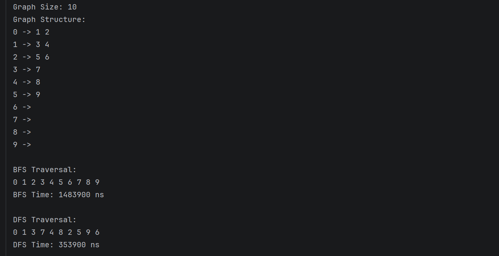
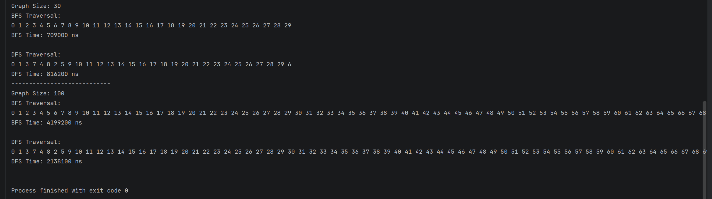

# Assignment 4: Graph Traversal and Representation System

## Project Overview

In this project, I implemented a graph traversal system using Java.

The graph was represented using an adjacency list structure.

I implemented two graph traversal algorithms:

* Breadth-First Search (BFS)
* Depth-First Search (DFS)

The purpose of this project was to understand how graph traversal works and compare BFS and DFS performance on graphs with different sizes.

The program was tested with:

* Small graph (10 vertices)
* Medium graph (30 vertices)
* Large graph (100 vertices)

Execution time was measured using `System.nanoTime()`.

---

# Graph Structure

A graph is a structure made of:

* Vertices (nodes)
* Edges (connections)

Example:

```text id="u1"
0 -> 1 2
1 -> 3 4
2 -> 5 6
```

This project uses an adjacency list representation.

An adjacency list stores neighboring vertices for each vertex.

---

# Class Descriptions

## Vertex Class

The `Vertex` class represents a node in the graph.

It contains:

* vertex id
* constructor
* getter
* toString() method

---

## Edge Class

The `Edge` class represents a connection between two vertices.

It contains:

* source vertex
* destination vertex
* getters
* toString() method

---

## Graph Class

The `Graph` class stores the graph using an adjacency list.

Main methods:

* addVertex()
* addEdge()
* printGraph()
* bfs()
* dfs()

---

## Experiment Class

The `Experiment` class is responsible for:

* running BFS and DFS
* measuring execution time
* testing graphs with different sizes

---

# BFS (Breadth-First Search)

## How BFS Works

BFS explores the graph level by level.

It uses a Queue data structure.

Example traversal:

```text id="u2"
0 → 1 → 2 → 3 → 4
```

---

## BFS Use Cases

* shortest path problems
* network traversal
* level-order exploration

---

## BFS Time Complexity

O(V+E)

Where:

* V = number of vertices
* E = number of edges

---

# DFS (Depth-First Search)

## How DFS Works

DFS explores deeply before backtracking.

It uses recursion.

Example traversal:

```text id="u3"
0 → 1 → 3 → 7 → 4
```

---

## DFS Use Cases

* path finding
* maze solving
* cycle detection

---

## DFS Time Complexity

O(V+E)

---

# Experimental Results

| Graph Size   |   BFS Time |   DFS Time |
| ------------ | ---------: | ---------: |
| 10 Vertices  | 1483900 ns |  353900 ns |
| 30 Vertices  |  709000 ns |  816200 ns |
| 100 Vertices | 4199200 ns | 2138100 ns |

---

# Analysis

## How does graph size affect BFS and DFS?

As graph size increases, execution time also increases because more vertices and edges must be visited.

---

## Which traversal was faster?

DFS was faster on small and large graphs in my experiments.

However, BFS performed slightly better on the medium graph.

The difference depends on graph structure and traversal order.

---

## Do results match O(V + E)?

Yes.

Both algorithms visit vertices and edges once, so the results are similar to the expected complexity.

---

## How does graph structure affect traversal order?

Traversal order depends on how vertices are connected.

BFS explores level by level, while DFS goes deeper first.

---

## When is BFS preferred over DFS?

BFS is preferred when finding the shortest path in an unweighted graph.

---

## What are the limitations of DFS?

DFS may use more recursion stack memory and can go very deep in large graphs.

---

# Screenshots 
1 Output



2 Output



# Reflection

This project helped me understand how graph traversal algorithms work in practice.

I learned the difference between BFS and DFS and how graph structure affects traversal order.

The most difficult part was understanding recursion in DFS and implementing the adjacency list correctly.

I also learned how to measure algorithm performance using System.nanoTime() and compare execution times for different graph sizes.
